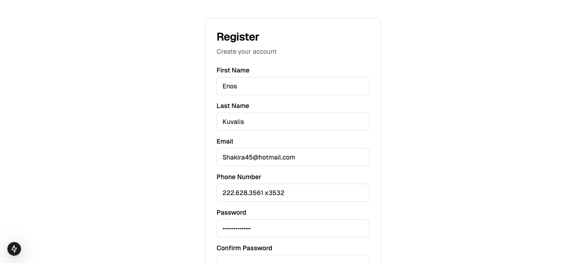

# Blue Buddy — Caregiver Dashboard

**Hacker's Choice Award — HackMT 2025**

Frontend for [Blue Buddy](https://github.com/Philopateer2099/blue-buddy), an AI patient check-in system that phones patients on a schedule, holds a GPT-4o voice conversation via Twilio, and reports back to caregivers.

This dashboard is where caregivers:

- Sign up and register their patient (bio, prescriptions, phone number)
- Schedule recurring check-in calls with a date/time picker
- Review call logs: what the patient said, medication adherence, flagged concerns



## Stack

- **Next.js** (App Router) + TypeScript
- **Tailwind CSS** + shadcn/ui (Radix primitives)
- Talks to the [FastAPI backend](https://github.com/Philopateer2099/blue-buddy)

## Running locally

```bash
bun install
bun run dev
```

Point the API base URL at a running instance of the backend (see backend README for Twilio/ngrok setup).

Built by a student team in one weekend at [HackMT 2025](https://www.hackmt.com/).
